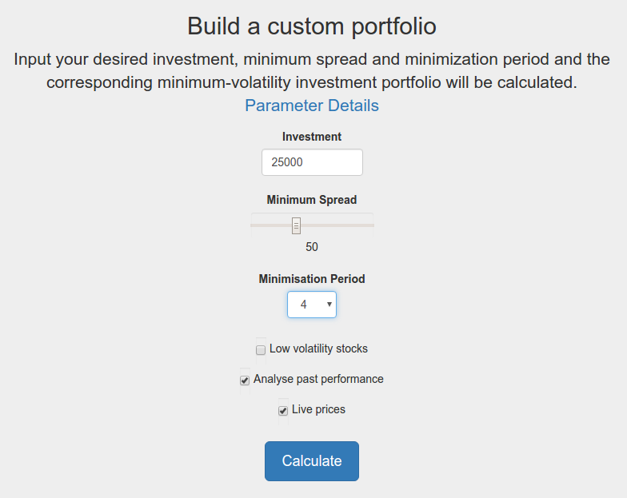
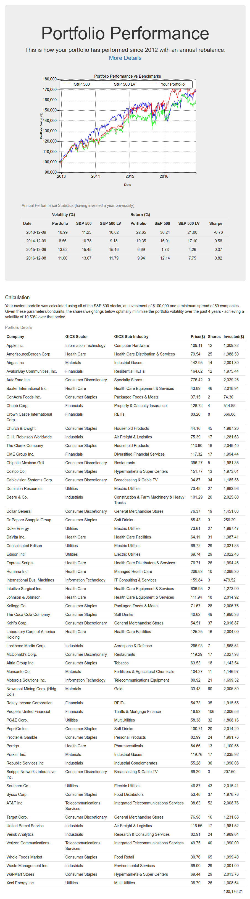
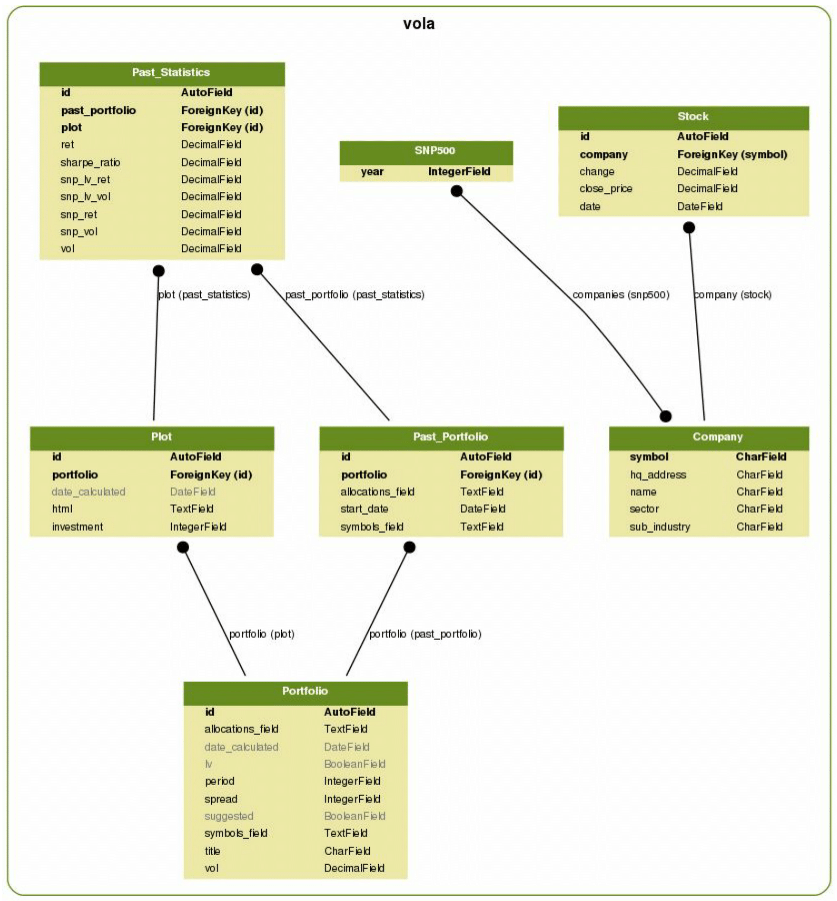

# Minimium Volatility Portfolios
A fast, flexible and self-maintaining real-time web application which calculates optimal minimum volatility portfolios (MVPs) using historical stock data.

## Prerequisites
* Python 3.4.2+, NumPy, SciPy, Django
* `pip install -r requirements.txt`

## Setup
* Env variables (in virtual env)
  * bin/activate
    * `export OLD_PYTHONPATH="$PYTHONPATH"`
    * `export PYTHONPATH="/the/path/to/mvp/"`
    * `export DJANGO_SETTINGS_MODULE=fyp.settings`
  * bin/deactivate
    * `export PYTHONPATH="$OLD_PYTHONPATH"`
* Database
  * Create database tables for installed apps (vola, admin, etc.)
    * `python manage.py migrate`
  * Scrape all necessary stock data from Yahoo Finance & pre-calculate some mvps
    * `python db/reconstruct.py`
  * Create new admin user
    * `python manage.py createsuperuser`
* Start the web application (development server)
  * `python manage.py runserver`
* Open web app
  * Home: http://127.0.0.1:8000/
  * Admin: http://127.0.0.1:8000/admin

## Main files
* **vola/minimizer.py**: provides functions to calculate the shares that minimize the portfolio's historical volatility. 
  * *minimize()*: Utilizes scipy minimize function with Sequential Least SQuares Programming (SLSQP) to minimize the standard deviation of the given daily returns.
* **vola/portfolioAnalyzer.py**: provides functions to analyze a portfolio. Includes performance simulation against benchmarks and statistics calculation.
* **vola/portfolioCalculator.py**: provides functions for retrieving, calculating and storing portfolios and their past performances.
* **vola/admin.py**: configures the admin application and provides a web API for database updates. 
* **db/maintenance_multiprocessing.py**: provides efficient functions to keep the database up to date.
* **db/reconstruction.py**: contains manual functions needed to reconstruct the database.
* **scraper/snp500.py**: provides a an API for retrieving the latest S&P 500 constituents from Wikipedia.
* **scraper/ystockquote.py**: provides an API for retrieving stock data from Yahoo Finance.

## Functionality
* Instantly calculate a custom and optimal MVP using live stock prices on the New York Stock Exchange (NYSE).
  * **Input:** investment, minimum spread (number of companies, diversification), minimisation period (years), low volatility stocks only (boolean)
  
  
  
  * **Output:** MVP constituent stocks and corresponding shares for given investment, performance statistics over minimisation period
  
  
  
* Secure admin site for maintaining stock database (See screenshots in images folder for examples of functionality)
  * Update all company stocks (scrape latest from Yahoo Finance)
  * Update current S&P 500 constituents (scrape this info from Wikipedia) and populate stock data back to 1988 for any new companies added.
  * Update portfolio calucations (recalculate optimal allocations for all parameter combinations with latest stock data)
  * Update portfolio performances (recalculate performances statistics and graphs vs. benchmark indexes)

## Data model
* **Company:** Stores a single company entry.
* **Stock:** Stores a single stock entry. Each stock is related to a single company. 
* **SNP500:** Stores a single year and the corresponding S&P 500 constituents on the 1st of January of that year. Each object is related to many companies.
* **Portfolio:** Stores a single minimum-volatility portfolio for specific parameters. Allocations are real-valued and sum to one, hence are independent of investment. Only symbols with non-zero allocations are stored. This significantly boosts performance when retrieving stocks for those symbols.
* **Plot**: Stores a single past performance plot. Each object stores the plot that results from scaling the related portfolio allocations by a specific investment, rounding to the closest share and plotting its past performance against suitable benchmarks. Hence, each object is related to a single portfolio.
* **Past_Portfolio:** Stores a single past portfolio, i.e., a past minimum-volatility portfolio for the minimisation parameters of it’s related portfolio. Enables precalculation of the minimisation function at specific dates in the past. Like portfolio, it is independent of investment to allow flexibility.
* **Past_Statistics:** Stores a single past statistics record for a given past portfolio and investment (plot object). Each object stores performance statistics over the year following the start date of the related past portfolio. Like the plot object, the allocations of the related past portfolio are scaled by the investment of the related plot and rounded to the closest share before calculating performance statistics over the following year. As a result, the past_statistics and plot objects are updated simultaneously.

## Limitations
* Yahoo Finance data is dirty
  * Missing stocks, SNP companies (mergers, acquisitions, etc.)

